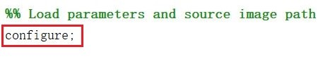
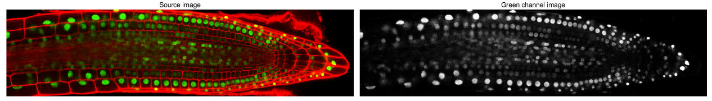
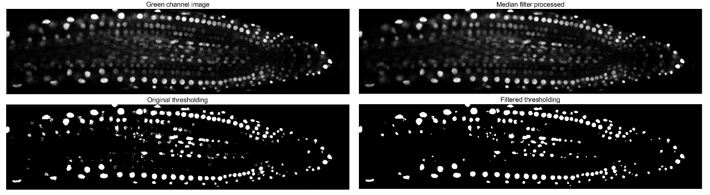
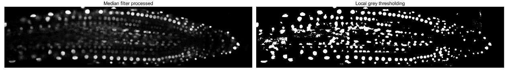
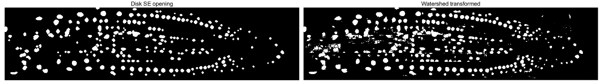
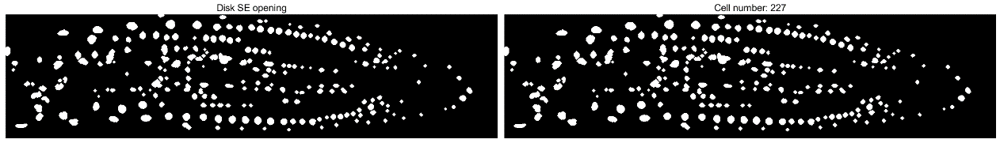

# **Read Me**

* <code>main.m</code>

    Execution code, main will execute the entire pipeline.

* imageSouce file

    Image source should be stored in imageSource file

    Could be changed in <code>configure.m</code>
    
----

## **Implementation Features:**

In this part, key features of the implementation are outlined with brief descriptions. Explanation towards the obtained results will be provided in the second part and approach evaluations are covered in the last part of this report. 

The main features of this image processing pipeline could be summarized into four aspects:

1. **Cell nuclei preservation**

    Achieved by applying local Otsu threshold method for thresholding (Stage 3) and disk shape structuring element for morphological image process (Stage 5).

    Throughout the pipeline, cell nuclei are preserved as much as possible in order to enhance the accuracy of quantitative data extracted from source image.

2. **Cell nuclei separation**

    The watershed transforms for segmentation (Stage 4) and opening operator for morphological image process (Stage 5) realized cell nuclei separation.

    The drawbacks caused by cell nuclei preservation have been minimized by segmentation process. Connecting cell nuclei will be segregated according to their disparities in shapes and colors.

3.	**Noise reduction and interference elimination**

    Green channel extraction for color space conservation (Stage 1), median filter applied in noise reduction (Stage 2) and opening operator for morphological image process (Stage 5) are responsible for noise reduction and interference elimination.

    The noise and pixel fragmentations have been significantly eliminated by this pipeline which is essential for the accuracy of the export quantitative data.

4.	**Quantitative data export**

    A labeling function is applied in the quantitative data export stage (Stage 6).

    In order to achieve high automatic, this program will automatically calculate the number of cell nuclei within the output image.

----

## **Image Processing Pipeline Overview:**

In the second part of this report, each stage within this image processing pipeline will be demonstrated.

0.	**Environment configuration**

    Before executing the image processing pipeline, a configure file is loaded to set all related parameters to a target value. The access path towards processing images is loaded simultaneously.

    

    This file is developed to simplify the process of changing parameters and file path towards source images.

1.	**Color space conversion**

    * Green channel extraction

    

2.	**Noise reduction**

    * Median filter
    * Filter size $3 \times 3$

    

3.	**Thresholding**

    * Local thresholding
    * Segmentation size $16 \times 128$
    * Otsu threshold method

    

4.	**Segmentation**

    * Watershed transform
    * Minima deviation 0.4

    

5.	**Morphological image process**

    * Morphological operator -- Opening
    * Erosion times -- 3
    * Dilation times -- 3
    * Structuring element shape -- Disk
    * Structuring element radius -- 1

    

6.	**Quantitative data export**

    

----

***More detailed explaination towards the choice of each stage could be refered [here](./report/scykw1.pdf)***